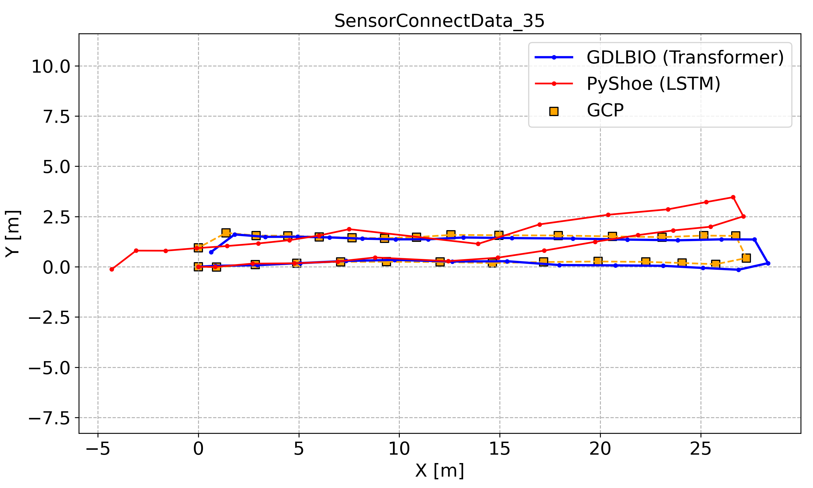
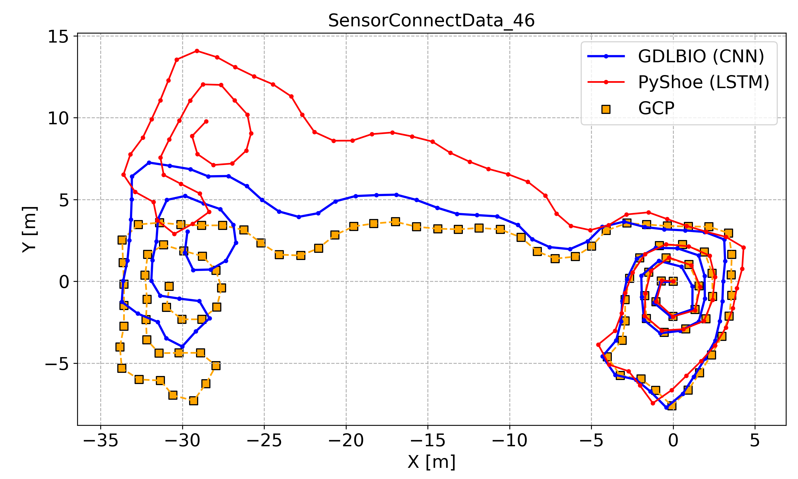
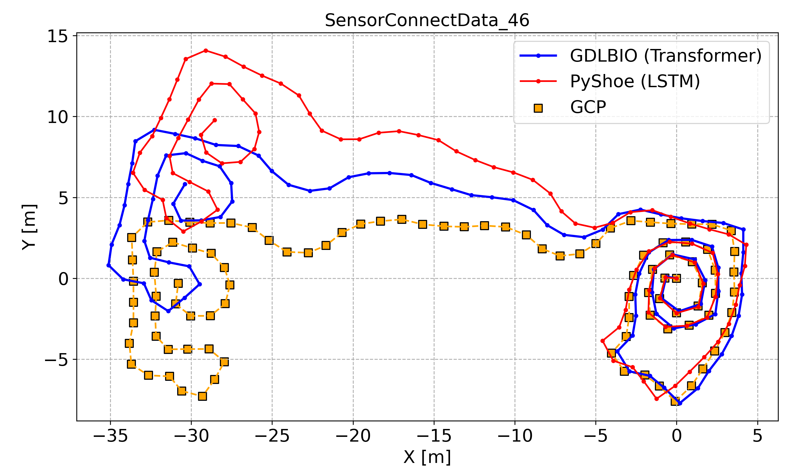
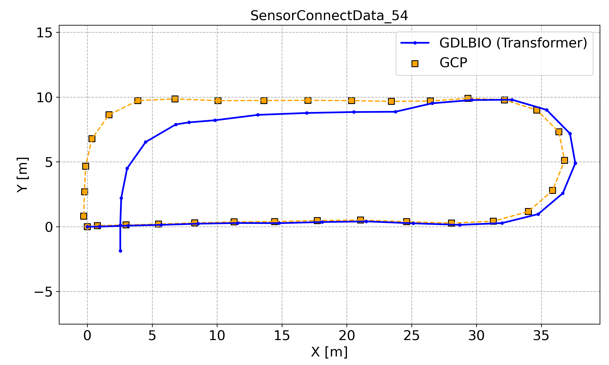
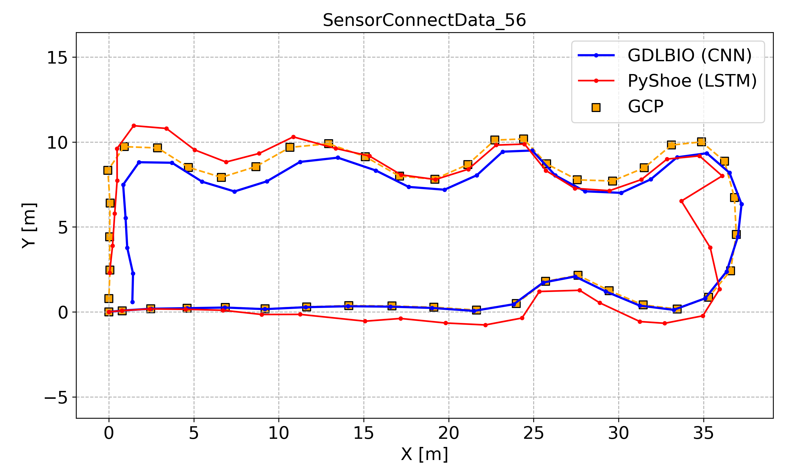
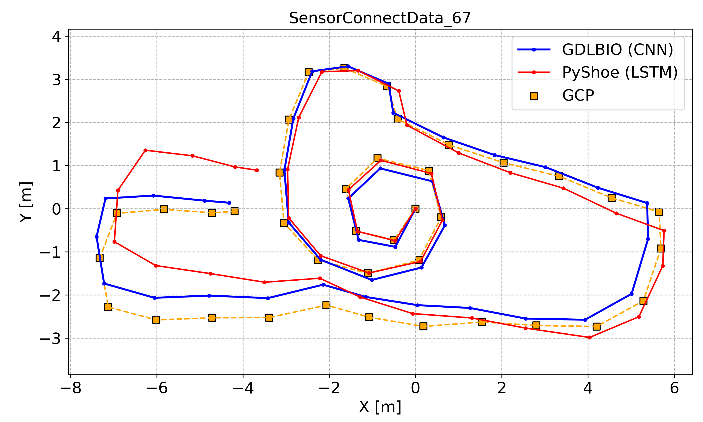
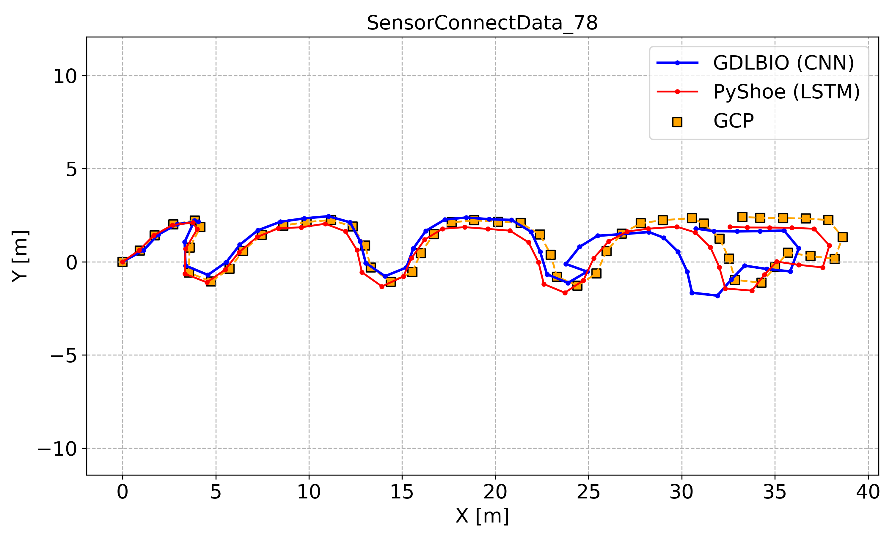

| Experiment #30 (Training) GDLBIO (LSTM) | Experiment #30 (Training) GDLBIO (CNN) | Experiment #30 (Training) GDLBIO (Transformer) |
| :--: | :--: | :--: |
|  |  |  |

| Experiment #31 (Training) GDLBIO (LSTM) | Experiment #31 (Training) GDLBIO (CNN) | Experiment #31 (Training) GDLBIO (Transformer) |
| :--: | :--: | :--: |
|  |  |  |

| Experiment #32 (Training) GDLBIO (LSTM) | Experiment #32 (Training) GDLBIO (CNN) | Experiment #32 (Training) GDLBIO (Transformer) |
| :--: | :--: | :--: |
|  |  |  |

| Experiment #33 (Training) GDLBIO (LSTM) | Experiment #33 (Training) GDLBIO (CNN) | Experiment #33 (Training) GDLBIO (Transformer) |
| :--: | :--: | :--: |
|  |  |  |

| Experiment #34 (Training) GDLBIO (LSTM) | Experiment #34 (Training) GDLBIO (CNN) | Experiment #34 (Training) GDLBIO (Transformer) |
| :--: | :--: | :--: |
|  |  |  |

| Experiment #35 (Training) GDLBIO (LSTM) | Experiment #35 (Training) GDLBIO (CNN) | Experiment #35 (Training) GDLBIO (Transformer) |
| :--: | :--: | :--: |
|  |  |  |

| Experiment #36 (Training) GDLBIO (LSTM) | Experiment #36 (Training) GDLBIO (CNN) | Experiment #36 (Training) GDLBIO (Transformer) |
| :--: | :--: | :--: |
|  |  |  |

| Experiment #37 (Training) GDLBIO (LSTM) | Experiment #37 (Training) GDLBIO (CNN) | Experiment #37 (Training) GDLBIO (Transformer) |
| :--: | :--: | :--: |
|  |  |  |

| Experiment #38 (Training) GDLBIO (LSTM) | Experiment #38 (Training) GDLBIO (CNN) | Experiment #38 (Training) GDLBIO (Transformer) |
| :--: | :--: | :--: |
|  |  |  |

| Experiment #39 (Training) GDLBIO (LSTM) | Experiment #39 (Training) GDLBIO (CNN) | Experiment #39 (Training) GDLBIO (Transformer) |
| :--: | :--: | :--: |
|  |  |  |

| Experiment #40 (Training) GDLBIO (LSTM) | Experiment #40 (Training) GDLBIO (CNN) | Experiment #40 (Training) GDLBIO (Transformer) |
| :--: | :--: | :--: |
|  |  |  |

| Experiment #41 (Training) GDLBIO (LSTM) | Experiment #41 (Training) GDLBIO (CNN) | Experiment #41 (Training) GDLBIO (Transformer) |
| :--: | :--: | :--: |
|  |  |  |

| Experiment #42 (Training) GDLBIO (LSTM) | Experiment #42 (Training) GDLBIO (CNN) | Experiment #42 (Training) GDLBIO (Transformer) |
| :--: | :--: | :--: |
|  |  |  |

| Experiment #43 (Training) GDLBIO (LSTM) | Experiment #43 (Training) GDLBIO (CNN) | Experiment #43 (Training) GDLBIO (Transformer) |
| :--: | :--: | :--: |
|  |  |  |

| Experiment #44 (Training) GDLBIO (LSTM) | Experiment #44 (Training) GDLBIO (CNN) | Experiment #44 (Training) GDLBIO (Transformer) |
| :--: | :--: | :--: |
|  |  |  |

| Experiment #45 (Training) GDLBIO (LSTM) | Experiment #45 (Training) GDLBIO (CNN) | Experiment #45 (Training) GDLBIO (Transformer) |
| :--: | :--: | :--: |
|  |  |  |

| Experiment #46 (Training) GDLBIO (LSTM) | Experiment #46 (Training) GDLBIO (CNN) | Experiment #46 (Training) GDLBIO (Transformer) |
| :--: | :--: | :--: |
|  |  |  |

| Experiment #47 (Training) GDLBIO (LSTM) | Experiment #47 (Training) GDLBIO (CNN) | Experiment #47 (Training) GDLBIO (Transformer) |
| :--: | :--: | :--: |
|  |  |  |

| Experiment #48 (Training) GDLBIO (LSTM) | Experiment #48 (Training) GDLBIO (CNN) | Experiment #48 (Training) GDLBIO (Transformer) |
| :--: | :--: | :--: |
|  |  |  |

| Experiment #49 (Training) GDLBIO (LSTM) | Experiment #49 (Training) GDLBIO (CNN) | Experiment #49 (Training) GDLBIO (Transformer) |
| :--: | :--: | :--: |
|  |  |  |

| Experiment #50 (Training) GDLBIO (LSTM) | Experiment #50 (Training) GDLBIO (CNN) | Experiment #50 (Training) GDLBIO (Transformer) |
| :--: | :--: | :--: |
|  |  |  |

| Experiment #51 (Training) GDLBIO (LSTM) | Experiment #51 (Training) GDLBIO (CNN) | Experiment #51 (Training) GDLBIO (Transformer) |
| :--: | :--: | :--: |
|  |  |  |

| Experiment #52 (Training) GDLBIO (LSTM) | Experiment #52 (Training) GDLBIO (CNN) | Experiment #52 (Training) GDLBIO (Transformer) |
| :--: | :--: | :--: |
|  |  |  |

| Experiment #53 (Training) GDLBIO (LSTM) | Experiment #53 (Training) GDLBIO (CNN) | Experiment #53 (Training) GDLBIO (Transformer) |
| :--: | :--: | :--: |
|  |  |  |

| Experiment #54 (Training) GDLBIO (LSTM) | Experiment #54 (Training) GDLBIO (CNN) | Experiment #54 (Training) GDLBIO (Transformer) |
| :--: | :--: | :--: |
|  |  |  |

| Experiment #55 (Training) GDLBIO (LSTM) | Experiment #55 (Training) GDLBIO (CNN) | Experiment #55 (Training) GDLBIO (Transformer) |
| :--: | :--: | :--: |
|  |  |  |

| Experiment #56 (Training) GDLBIO (LSTM) | Experiment #56 (Training) GDLBIO (CNN) | Experiment #56 (Training) GDLBIO (Transformer) |
| :--: | :--: | :--: |
|  |  |  |

| Experiment #57 (Training) GDLBIO (LSTM) | Experiment #57 (Training) GDLBIO (CNN) | Experiment #57 (Training) GDLBIO (Transformer) |
| :--: | :--: | :--: |
|  |  |  |

| Experiment #58 (Training) GDLBIO (LSTM) | Experiment #58 (Training) GDLBIO (CNN) | Experiment #58 (Training) GDLBIO (Transformer) |
| :--: | :--: | :--: |
|  |  |  |

| Experiment #59 (Training) GDLBIO (LSTM) | Experiment #59 (Training) GDLBIO (CNN) | Experiment #59 (Training) GDLBIO (Transformer) |
| :--: | :--: | :--: |
|  |  |  |

| Experiment #61 (Training) GDLBIO (LSTM) | Experiment #61 (Training) GDLBIO (CNN) | Experiment #61 (Training) GDLBIO (Transformer) |
| :--: | :--: | :--: |
|  |  |  |

| Experiment #62 (Training) GDLBIO (LSTM) | Experiment #62 (Training) GDLBIO (CNN) | Experiment #62 (Training) GDLBIO (Transformer) |
| :--: | :--: | :--: |
|  |  |  |

| Experiment #63 (Training) GDLBIO (LSTM) | Experiment #63 (Training) GDLBIO (CNN) | Experiment #63 (Training) GDLBIO (Transformer) |
| :--: | :--: | :--: |
|  |  |  |

| Experiment #64 (Training) GDLBIO (LSTM) | Experiment #64 (Training) GDLBIO (CNN) | Experiment #64 (Training) GDLBIO (Transformer) |
| :--: | :--: | :--: |
|  |  |  |

| Experiment #65 (Training) GDLBIO (LSTM) | Experiment #65 (Training) GDLBIO (CNN) | Experiment #65 (Training) GDLBIO (Transformer) |
| :--: | :--: | :--: |
|  |  |  |

| Experiment #66 (Training) GDLBIO (LSTM) | Experiment #66 (Training) GDLBIO (CNN) | Experiment #66 (Training) GDLBIO (Transformer) |
| :--: | :--: | :--: |
|  |  |  |

| Experiment #67 (Training) GDLBIO (LSTM) | Experiment #67 (Training) GDLBIO (CNN) | Experiment #67 (Training) GDLBIO (Transformer) |
| :--: | :--: | :--: |
|  |  |  |

| Experiment #68 (Training) GDLBIO (LSTM) | Experiment #68 (Training) GDLBIO (CNN) | Experiment #68 (Training) GDLBIO (Transformer) |
| :--: | :--: | :--: |
|  |  |  |

| Experiment #69 (Training) GDLBIO (LSTM) | Experiment #69 (Training) GDLBIO (CNN) | Experiment #69 (Training) GDLBIO (Transformer) |
| :--: | :--: | :--: |
|  |  |  |

| Experiment #70 (Training) GDLBIO (LSTM) | Experiment #70 (Training) GDLBIO (CNN) | Experiment #70 (Training) GDLBIO (Transformer) |
| :--: | :--: | :--: |
|  |  |  |

| Experiment #71 (Training) GDLBIO (LSTM) | Experiment #71 (Training) GDLBIO (CNN) | Experiment #71 (Training) GDLBIO (Transformer) |
| :--: | :--: | :--: |
|  |  |  |

| Experiment #72 (Training) GDLBIO (LSTM) | Experiment #72 (Training) GDLBIO (CNN) | Experiment #72 (Training) GDLBIO (Transformer) |
| :--: | :--: | :--: |
|  |  |  |

| Experiment #73 (Training) GDLBIO (LSTM) | Experiment #73 (Training) GDLBIO (CNN) | Experiment #73 (Training) GDLBIO (Transformer) |
| :--: | :--: | :--: |
|  |  |  |

| Experiment #74 (Training) GDLBIO (LSTM) | Experiment #74 (Training) GDLBIO (CNN) | Experiment #74 (Training) GDLBIO (Transformer) |
| :--: | :--: | :--: |
|  |  |  |

| Experiment #75 (Training) GDLBIO (LSTM) | Experiment #75 (Training) GDLBIO (CNN) | Experiment #75 (Training) GDLBIO (Transformer) |
| :--: | :--: | :--: |
|  |  |  |

| Experiment #76 (Training) GDLBIO (LSTM) | Experiment #76 (Training) GDLBIO (CNN) | Experiment #76 (Training) GDLBIO (Transformer) |
| :--: | :--: | :--: |
|  |  |  |

| Experiment #77 (Training) GDLBIO (LSTM) | Experiment #77 (Training) GDLBIO (CNN) | Experiment #77 (Training) GDLBIO (Transformer) |
| :--: | :--: | :--: |
|  |  |  |

| Experiment #78 (Training) GDLBIO (LSTM) | Experiment #78 (Training) GDLBIO (CNN) | Experiment #78 (Training) GDLBIO (Transformer) |
| :--: | :--: | :--: |
|  |  |  |

| Experiment #80 (Training) GDLBIO (LSTM) | Experiment #80 (Training) GDLBIO (CNN) | Experiment #80 (Training) GDLBIO (Transformer) |
| :--: | :--: | :--: |
|  |  |  |

| Experiment #81 (Training) GDLBIO (LSTM) | Experiment #81 (Training) GDLBIO (CNN) | Experiment #81 (Training) GDLBIO (Transformer) |
| :--: | :--: | :--: |
|  |  |  |
